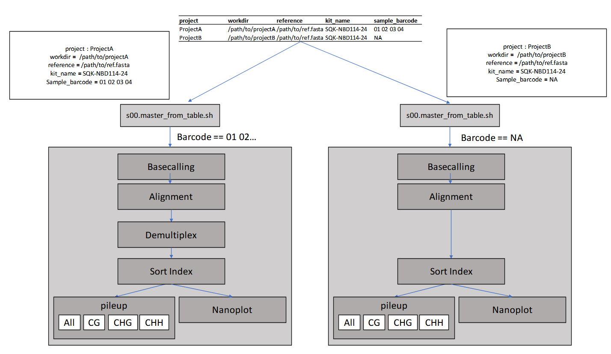

# PhD_EXP3_project_methylation_pipeline

# Nanopore run launcher

This repository contains a small helper script that launches per-project processing from a sample table.





Use the table `samples.tsv` (tab-separated) with the following columns:

| Column name     | Description |
|---|---|
| `project`       | Name of the project. This will be used to name output files and folders. |
| `workdir`       | Path to the nanopore directory; **must be the parent folder of the `pod5` folder** (e.g. `/scratch/user/run_A/`). |
| `reference`     | Path to the reference genome FASTA file used for mapping (absolute or repo-relative path). |
| `kit_name`      | Name of the ONT kit used (e.g. `SQK-RBK114-24`). |
| `sample_barcode`| Space-separated sample numbers **with two digits each** (e.g. `01 02 03`). If there was no multiplexing, use `NA`. *Note: `01` works but `1` does not — barcodes must be two-digit.* |

## How to run

Place the `samples.tsv` file in the repo root (or point the script to it), then run:

```bash
bash s00.master_from_table.sh samples.tsv
```

The script will iterate through the rows and perform the configured pipeline for each `project`.

---

## Example `samples_example.tsv` (contents from uploaded file)

| project   | workdir              | reference          | kit_name        | sample_barcode    |
|---|---|---|---|---|
| Project_A | /scratch/user/run_A/ | /refs/genome.fasta | SQK-RBK114-24   | 17 18 19 20       |
| Project_B | /scratch/user/run_B/ | /refs/genome.fasta | SQK-RBK114-24   | NA                |

---

## Helpful notes / sanity checks
- `workdir` must point to the parent directory that contains the `pod5` folder; the pipeline expects to find raw ONT data there.
- `sample_barcode` values must be two-digit barcode identifiers separated by spaces; for example `01 02` not `1 2`. Use `NA` when samples were run singleplex and there are no barcodes.
- `project` names should be filesystem-safe (no slashes or unusual characters) because they are used to name files and directories.
